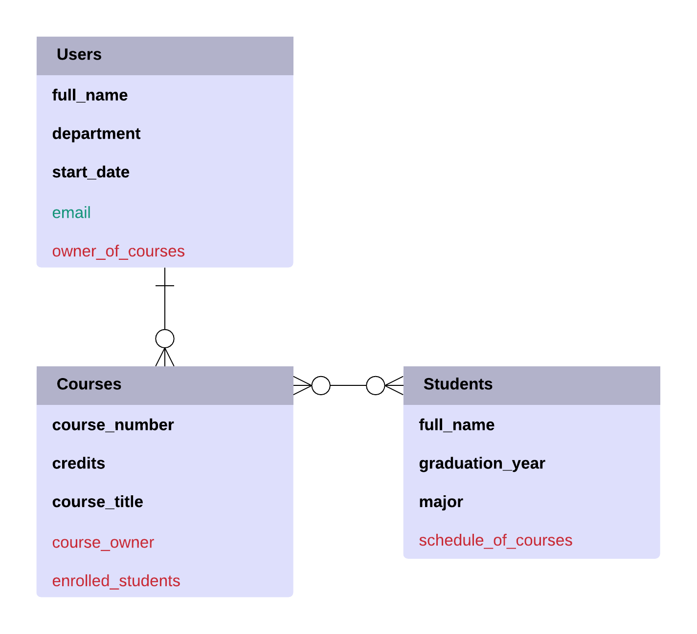

# Course Student API

This is a RESTful API that allows *Users* (i.e. instructors) create *Courses* and *Students*, and assign *Students* to their *Courses*. The API uses [Google Datastore](https://cloud.google.com/datastore/) as its database and [Auth0](https://auth0.com/) for user authentication. You can make API calls [here](https://cs493-final-project-derrick.appspot.com/).

## Database ER Diagram

    

### Description of Resource Properties
* A *User* has the following properties: **full_name**, **department**, and **start_date**.
-   A *Course* has the following properties:  **course_number** (unique value, i.e. *Courses* cannot share the same **course_number**), **credits**, and **course_title**.
-   A *Student* has the following properties: **full_name**, **graduation_year**, and **major**.

### Description of Relationships
* A *User* can create and own many *Courses*, while a *Course* has only one *User* as the owner—thus, a *User* has a One-to-Many relationship with *Courses*.
  * A *User* has an owner_of_courses property which is an array of *Courses* the *User* owns. Likewise, a *Course* has a course_owner property which indicates which *User* owns the *Course*. Additionally, a *User* has an email property which serves as the *User's* identifier in [Google Datastore](https://cloud.google.com/datastore/) and [Auth0](https://auth0.com/).
* A *Course* can have many *Students* enrolled, and similarly a *Student* can be taking many *Courses*-thus, *Courses* has a Many-to-Many relationship with *Students*.
  * A *Course* has an enrolled_students property which is an array of *Students* enrolled in the *Course*. Likewise, a *Student* has a schedule_of_courses property which is an array of *Courses* the *Students* have added to their schedule.

### Description of Authorization of Resources
* A *User* can only view and edit its own *User* resource. They cannot view or edit another *User* resource.
* A *User* must own a *Course* for them to make any edits to the *Course* (i.e. edit its properties, delete the *Course*, add *Students* to *Course*, and remove *Students* from *Course*); however, any *User* can view the *Course* without authentication.
* Any authenticated *User* can create and edit *Students* (including deletion). The *Student* resource isn’t own by any particular *User*, but does require a *User’s* authentication. However, any *User* can view the *Student* without authentication.

## Authentication Flow
1. *User* creates a new account using `POST /login/signup`.
2. *User* logs into account using `POST /login`. *User* saves the value to the property `id_token`.
3. For each request that requires authentication, *User* adds an `Authorization` header to request with the value `Bearer <id_token_value>`. Note that `Bearer` is the `token_type`.
  * For example, if the value of `id_token` returned from `POST /login` was `edc...u8a`. Then for each request that requires authentication, an `Authorization` header would be added with the value `Bearer edc...u8a`.
  * Note that `id_token` value is greater than 1000 characters in length. The above sample was simplified for readability.

## Routes
* [**POST /login/signup**](documentation.htm#POST-login-signup)
* [**POST /login**](documentation.htm#POST-login)
* [**GET /users/:email**](documentation.htm#GET-users-email)
* [**PUT /users/:email**](documentation.htm#PUT-users-email)
* [**DELETE /users/:email**](documentation.htm#DELETE-users-email)
* [**POST /courses**](documentation.htm#POST-courses)
* [**GET /courses**](documentation.htm#GET-courses)
* [**GET /courses/:course_id**](documentation.htm#GET-courses-course_id)
* [**PUT /courses/:course_id**](documentation.htm#PUT-courses-course_id)
* [**DELETE /courses/:course_id**](documentation.htm#DELETE-courses-course_id)
* [**PUT /courses/:course_id/students/:student_id**](documentation.htm#PUT-courses-course_id-students-student_id)
* [**DELETE /courses/:course_id/students/:student_id**](documentation.htm#DELETE-courses-course_id-students-student_id)
* [**POST /students**](documentation.htm#POST-students)
* [**GET /students**](documentation.htm#GET-students)
* [**GET /students/:student_id**](documentation.htm#GET-students-student_id)
* [**PUT /students/:student_id**](documentation.htm#PUT-students-student_id)
* [**DELETE /students/:student_id**](documentation.htm#DELETE-students-student_id)

